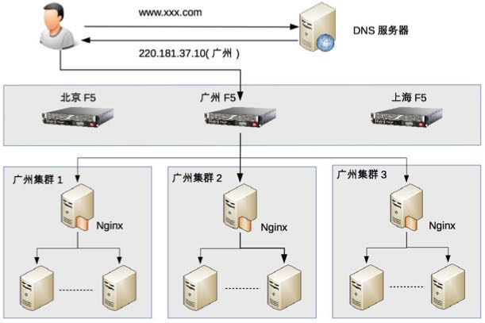

# 负载均衡的那些事

## 前言

面对大量用户访问、高并发请求，海量数据，可以使用高性能的服务器、大型数据库，存储设备，高性能Web服务器，当单机容量达到极限时，我们需要考虑业务拆分和分布式部署，来解决大型网站访问量大，并发量高，海量数据的问题。

从单机网站到分布式网站，很重要的区别是业务拆分和分布式部署，将应用拆分后，部署到不同的机器上，实现大规模分布式系统。分布式和业务拆分解决了，从集中到分布的问题，但是每个部署的独立业务还存在单点的问题和访问统一入口问题，为解决单点故障，我们可以采取冗余的方式。将相同的应用部署到多台机器上。解决访问统一入口问题，我们可以在集群前面增加负载均衡设备，实现流量分发。

## 一、什么是负载均衡

<!-- more -->

引用自维基百科的定义：

> **负载平衡**（Load balancing）是一种[计算机](https://zh.wikipedia.org/wiki/%E8%AE%A1%E7%AE%97%E6%9C%BA)技术，用来在多个计算机（[计算机集群](https://zh.wikipedia.org/wiki/%E8%AE%A1%E7%AE%97%E6%9C%BA%E9%9B%86%E7%BE%A4)）、网络连接、CPU、磁盘驱动器或其他资源中分配负载，以达到最优化资源使用、最大化吞吐率、最小化响应时间、同时避免过载的目的。 使用带有负载平衡的多个服务器组件，取代单一的组件，可以通过[冗余](https://zh.wikipedia.org/w/index.php?title=%E5%86%97%E4%BD%99&action=edit&redlink=1)提高可靠性。负载平衡服务通常是由专用软件和硬件来完成。 主要作用是将大量作业合理地分摊到多个操作单元上进行执行,用于解决互联网架构中的**高并发**和**高可用**的问题。

通俗的讲，就是将负载（工作任务，访问请求）进行平衡、分摊到多个操作单元（服务器，组件）上进行执行。是解决高性能，单点故障（高可用），扩展性（水平伸缩）的终极解决方案。

## 二、负载均衡原理

系统的扩展可分为纵向（垂直）扩展和横向（水平）扩展。纵向扩展，是从单机的角度通过增加硬件处理能力，比如CPU处理能力，内存容量，磁盘等方面，实现服务器处理能力的提升，不能满足大型分布式系统（网站），大流量，高并发，海量数据的问题。因此需要采用横向扩展的方式，通过添加机器来满足大型网站服务的处理能力。比如：一台机器不能满足，则增加两台或者多台机器，共同承担访问压力。这就是典型的集群和负载均衡架构：如下图：

客户端的流量首先会到达负载均衡服务器，由负载均衡服务器通过一定的调度算法将流量分发到不同的应用服务器上面，同时负载均衡服务器也会对应用服务器做周期性的**健康检查**，当发现故障节点时便动态的将节点从应用服务器集群中剔除，以此来保证应用的高可用。  

### 负载均衡的作用：

1. **高并发**，解决并发压力，提高应用处理性能（增加吞吐量，加强网络处理能力）；
2. **HTTP缓存**。负载均衡器可以存储静态内容，当用户请求它们时可以直接响应用户而不必再向后台服务器请求。
3. **健康检查**。负载均衡器可以检查后台服务器应用层的健康状况并从服务器池中移除那些出现故障的服务器。
4. **故障转移**，提供故障转移，实现高可用；
5. **安全防护**；（负载均衡设备上做一些过滤，黑白名单等处理）

## 三、负载均衡分类

负载均衡根据所采用的设备对象（**软/硬件负载均衡**），应用的OSI网络层次（**网络层次上的负载均衡**），及应用的地理结构（**本地/全局负载均衡**）等来分类。

### 1、DNS负载均衡

DNS（Domain Name System）负责域名解析的服务，域名url实际上是服务器的别名，实际映射是一个IP地址，解析过程，就是DNS完成域名到IP的映射。而一个域名是可以配置成对应多个IP的。因此，DNS也就可以作为负载均衡服务。

DNS 是最简单也是最常见的负载均衡方式，一般用来实现地理级...

**优点**:

1. 使用简单：负载均衡工作，交给DNS服务器处理，省掉了负载均衡服务器维护的麻烦
2. 提高性能：可以支持基于地址的域名解析，解析成距离用户最近的服务器地址，可以加快访问速度，改善性能；

**缺点:**

1. 可用性差：DNS解析是多级解析，新增/修改DNS后，解析时间较长；解析过程中，用户访问网站将失败；
2. 扩展性低：DNS负载均衡的控制权在域名商那里，无法对其做更多的改善和扩展；
3. 维护性差：也不能反映服务器的当前运行状态；支持的算法少；不能区分服务器的差异（不能根据系统与服务的状态来判断负载）

**应用场景:**

​	一般互联网web网站讲DNS作为第一级负载均衡，记录对应着内部负载均衡的IP地址，通过内部负载均衡将请求分发到真实的Web服务器上。

### 2、IP负载均衡（四层负载均衡 L4）

四层负载均衡工作在OSI模型的传输层，主要工作是转发，它在接收到客户端的流量以后通过修改数据包的地址信息（IP+Port）将流量转发到应用服务器。常见的负载均衡方式，是LVS（Linux Virtual Server，Linux虚拟服务），通过IPVS（IP Virtual Server，IP虚拟服务）来实现。有NAT, TUN（IP隧道）,DR（三角传输）三种请求转发模式。三者有一定区别，限于篇幅，后面再另外阐述。

 **优点：**

1. 在内核进程完成数据分发，比在应用层分发性能更好；
2. 四层LB对于应用侵入比较小，对应用的感知较少，应用接入基本不需要针对LB做任何的代码改造。

**缺点：**

1. 所有请求响应都需要经过负载均衡服务器，集群最大吞吐量受限于负载均衡服务器网卡带宽；
2. 没法对业务流量进行细粒度的调控

### 3、反向代理负载均衡 （七层负载均衡 L7）

七层负载均衡工作在OSI模型的应用层，因为它需要解析应用层流量，所以七层负载均衡在接到客户端的流量以后，还需要一个完整的TCP/IP协议栈。七层负载均衡会与客户端建立一条完整的连接并将应用层的请求流量解析出来，再按照调度算法选择一个应用服务器，并与应用服务器建立另外一条连接将请求发送过去。负载均衡和前端的客户端以及后端的服务器会分别建立TCP连接，本质上是一个**代理服务器**，因此七层负载均衡的主要工作就是**代理**。  

常见实现七层负载均衡的软件有：**nginx**、haproxy、Mysql proxy  

在四层负载均衡的基础上（没有四层是绝对不可能有七层的），再考虑应用层的特征，比如同一个Web服务器的负载均衡，除了根据VIP加80端口辨别是否需要处理的流量，还可根据七层的URL、浏览器类别、语言来决定是否要进行负载均衡。举个例子，如果你的Web服务器分成两组，一组是中文语言的，一组是英文语言的，那么七层负载均衡就可以当用户来访问你的域名时，自动辨别用户语言，然后选择对应的语言服务器组进行负载均衡处理。

七层负载均衡分析应用层的信息，如HTTP协议URI或Cookie信息，实现七层负载均衡。此种负载均衡器能理解应用协议。

**优点：**  

1. 七层负载均衡结合一些通用的业务流量负载逻辑和容灾逻辑可做成很细致的负载均衡和流量导向方案
2. 使整个网络更“智能化”，能把对图片类的请求转发到图片服务器，对文字的请求转发到文字服务器
3. 可以有效防止 SYN Flood攻击，使网站更安全

**缺点：**

1. 七层负载均衡一般对应用本身的感知比较多，一般接入七层负载均衡时，应用需要配合做相应的改造。

#### 4层和7层负载均衡区别

主要在**协议和灵活性**，Nginx支持应用层协议，如http、e-mail协议，而lvs是4层负载均衡，与协议无关，所有应用都支持。4层负载架构设计比较简单，无需解析具体的消息内容，在网络吞吐量及处理能力上会相对比较高，而7层负载均衡的优势则体现在功能多，控制灵活强大。在具体业务架构设计时，使用七层负载或者四层负载还得根据具体的情况综合考虑。  

举个例子形象的说明：四层负载均衡就像银行的自助排号机，每一个达到银行的客户根据排号机的顺序，选择对应的窗口接受服务；而七层负载均衡像银行大堂经理，先确认客户需要办理的业务，再安排排号。这样办理理财、存取款等业务的客户，会根据银行内部资源得到统一协调处理，加快客户业务办理流程。

|          | 四层负载均衡（layer 4） | 七层负载均衡（layer 7）                          |
| -------- | ----------------------- | ------------------------------------------------ |
| 基于     | 基于IP+Port的           | 基于虚拟的URL或主机IP等                          |
| 类似于   | 路由器                  | 代理服务器                                       |
| 握手次数 | 1 次                    | 2 次                                             |
| 性能     | 高；无需解析内容        | 中；需要算法识别 URL，Cookie 和 HTTP head 等信息 |
| 安全性   | 低，无法识别 DDoS等攻击 | 高， 可以防御SYN cookie以SYN flood等             |
| 额外功能 | 无                      | 会话保持，图片压缩，防盗链等                     |

### 4、硬件负载均衡

硬件负载均衡是通过单独的硬件设备来实现负载均衡功能，这类设备和路由器、交换机类似，可以理解为一个用于负载均衡的基础网络设备。目前业界典型的硬件负载均衡设备有两款：F5 和 A10。这类设备性能强劲、功能强大，但价格都不便宜，普通业务量级的公司一是负担不起，二是业务量没那么大，用这些设备也是浪费。

**优点：**

1. 功能强大：全面支持各层级的负载均衡，支持全面的负载均衡算法，支持全局负载均衡。
2. 性能强大：软件负载均衡支持到 5万级并发已经很厉害了，硬件负载均衡可以支持 100 万以上的并发。
3. 稳定性高：商用硬件负载均衡，经过了良好的严格测试，经过大规模使用，稳定性高。
4. 支持安全防护：硬件均衡设备除具备负载均衡功能外，还具备防火墙、防 DDoS 攻击等安全功能。

**缺点：**

1. 价格昂贵，F5 价格：15w~55w不等；A10 价格：55w-100w不等；
2. 扩展能力差，硬件设备，可以根据业务进行配置，但无法进行扩展和定制

## 四、负载均衡典型架构

 3 种常见的负载均衡机制：DNS 负载均衡、硬件负载均衡、软件负载均衡，每种方式都有一些优缺点，基于它们的优缺点进行组合使用。具体来说，组合的基本原则为：DNS 负载均衡用于实现地理级别的负载均衡；硬件负载均衡用于实现集群级别的负载均衡；软件负载均衡用于实现机器级别的负载均衡。

如下图所示。

整个系统的负载均衡分为三层。

**地理级别负载均衡**：[www.xxx.com](http://www.xxx.com) 部署在北京、广州、上海三个机房，当用户访问时，DNS 会根据用户的地理位置来决定返回哪个机房的 IP，图中返回了广州机房的 IP 地址，这样用户就访问到广州机房了。

**集群级别负载均衡**：广州机房的负载均衡用的是 F5 设备，F5 收到用户请求后，进行集群级别的负载均衡，将用户请求发给 3 个本地集群中的一个，我们假设 F5 将用户请求发给了“广州集群 2”。

**机器级别的负载均衡**：广州集群 2 的负载均衡用的是 Nginx，Nginx 收到用户请求后，将用户请求发送给集群里面的某台服务器，服务器处理用户的业务请求并返回业务响应。

需要注意的是，上图只是一个示例，一般在大型业务场景下才会这样用，如果业务量没这么大，则没有必要严格照搬这套架构。例如，一个大学的论坛，完全可以不需要 DNS 负载均衡，也不需要 F5 设备，只需要用 Nginx 作为一个简单的负载均衡就足够了

## 五、负载均衡算法

### 1、轮询

负载均衡系统收到请求后，按照顺序轮流分配到服务器上。轮询是最简单的一个策略，无须关注服务器本身的状态，适合服务器硬件同相同的场景。

集群中配置不一样，负载均衡系统也是不关注的，有新的机器是 32 核的，老的机器是 16 核的，新老机器分配的任务数是一样的。

需要注意的是负载均衡系统无须关注“服务器本身状态”，这里的关键词是“本身”。也就是说，只要服务器在运行，运行状态是不关注的。但如果服务器直接宕机了，或者服务器和负载均衡系统断连了，这时负载均衡系统是能够感知的，也需要做出相应的处理。例如，将服务器从可分配服务器列表中删除，否则就会出现服务器都宕机了，任务还不断地分配给它，这明显是不合理的。

**优点：** 简单

**缺点**： 服务器压力不一样，不适合服务器配置不同的情况；

### 2、加权轮询

负载均衡系统根据服务器权重进行任务分配，这里的权重一般是根据硬件配置进行静态配置的，采用动态的方式计算会更加契合业务，但复杂度也会更高。

加权轮询是轮询的一种特殊形式，其主要目的就是为了解决不同服务器处理能力有差异的问题。例如，集群中有新的机器是 32 核的，老的机器是 16 核的，那么理论上我们可以假设新机器的处理能力是老机器的 2 倍，负载均衡系统就可以按照 2:1 的比例分配更多的任务给新机器，从而充分利用新机器的性能。

**优点：**

1. 根据权重，调节转发服务器的请求数目，解决了轮询算法中无法根据服务器的配置差异进行任务分配的问题

**缺点：**

1. 使用相对复杂
2. 还是无法根据服务器的状态差异进行任务分配的问题。

### 3、负载最低优先

负载均衡系统将任务分配给当前负载最低的服务器，这里的负载根据不同的任务类型和业务场景，可以用不同的指标来衡量。例如：

1. LVS 这种 4 层网络负载均衡设备，可以以“**连接数**”来判断服务器的状态，服务器连接数越大，表明服务器压力越大
2.  Nginx 这种 7 层网络负载系统，可以以“**HTTP 请求数**”来判断服务器状态（Nginx 内置的负载均衡算法不支持这种方式，需要进行扩展）。

如果我们自己开发负载均衡系统，可以根据业务特点来选择指标衡量系统压力。如果是 CPU 密集型，可以以“CPU 负载”来衡量系统压力；如果是 I/O 密集型，可以以“I/O 负载”来衡量系统压力。

负载最低优先的算法解决了轮询算法中无法感知服务器状态的问题，由此带来的代价是复杂度要增加很多。例如：

最少连接数优先的算法要求负载均衡系统统计每个服务器当前建立的连接，其应用场景仅限于负载均衡接收的任何连接请求都会转发给服务器进行处理，否则如果负载均衡系统和服务器之间是固定的连接池方式，就不适合采取这种算法。例如，LVS 可以采取这种算法进行负载均衡，而一个通过连接池的方式连接 MySQL 集群的负载均衡系统就不适合采取这种算法进行负载均衡。

CPU 负载最低优先的算法要求负载均衡系统以某种方式收集每个服务器的 CPU 负载，而且要确定是以 1 分钟的负载为标准，还是以 15 分钟的负载为标准，不存在 1 分钟肯定比 15 分钟要好或者差。不同业务最优的时间间隔是不一样的，时间间隔太短容易造成频繁波动，时间间隔太长又可能造成峰值来临时响应缓慢。

负载最低优先算法基本上能够比较完美地解决轮询算法的缺点，因为采用这种算法后，负载均衡系统需要感知服务器当前的运行状态。当然，其代价是复杂度大幅上升。通俗来讲，轮询可能是 5 行代码就能实现的算法，而负载最低优先算法可能要 1000 行才能实现，甚至需要负载均衡系统和服务器都要开发代码。负载最低优先算法如果本身没有设计好，或者不适合业务的运行特点，算法本身就可能成为性能的瓶颈，或者引发很多莫名其妙的问题。所以负载最低优先算法虽然效果看起来很美好，但实际上真正应用的场景反而没有轮询（包括加权轮询）那么多。

### 4、Hash 类

负载均衡系统根据任务中的某些关键信息进行 Hash 运算，将相同 Hash 值的请求分配到同一台服务器上，这样做的目的主要是为了满足特定的业务需求。常见的有源地址 Hash、目标地址 Hash、session ID hash 、用户id hash，例如：

**1、源地址 Hash**

将来源于同一个源 IP 地址的任务分配给同一个服务器进行处理，适合于存在事务、会话的业务。例如，当我们通过浏览器登录网上银行时，会生成一个会话信息，这个会话是临时的，关闭浏览器后就失效。网上银行后台无须持久化会话信息，只需要在某台服务器上临时保存这个会话就可以了，但需要保证用户在会话存在期间，每次都能访问到同一个服务器，这种业务场景就可以用源地址 Hash 来实现。

**2、ID Hash**

将某个 ID 标识的业务分配到同一个服务器中进行处理，这里的 ID 一般是临时性数据的 ID（如 session id）。例如，上述的网上银行登录的例子，用 session id hash 同样可以实现同一个会话期间，用户每次都是访问到同一台服务器的目的。

## 参考资料

1. [大型网站架构系列：负载均衡详解](https://www.cnblogs.com/itfly8/p/5043435.html)
2. [负载均衡](https://zh.wikipedia.org/wiki/负载均衡)
3. [MGW——美团点评高性能四层负载均衡](https://tech.meituan.com/MGW.html)
4. 极客时间：[从0开始学架构](https://time.geekbang.org/column/81) 
5. [载均衡总结（四层负载与七层负载的区别)](https://www.jianshu.com/p/9826d866080a)
